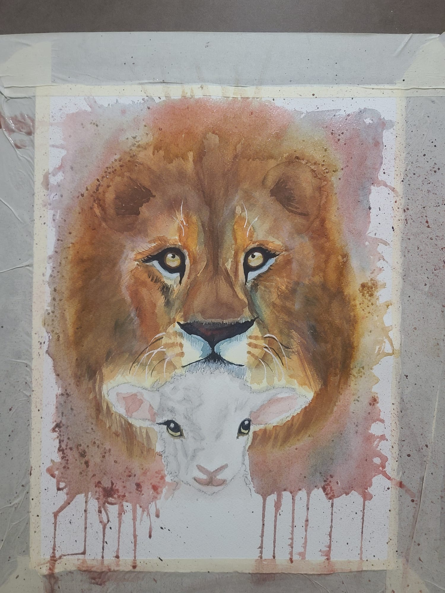
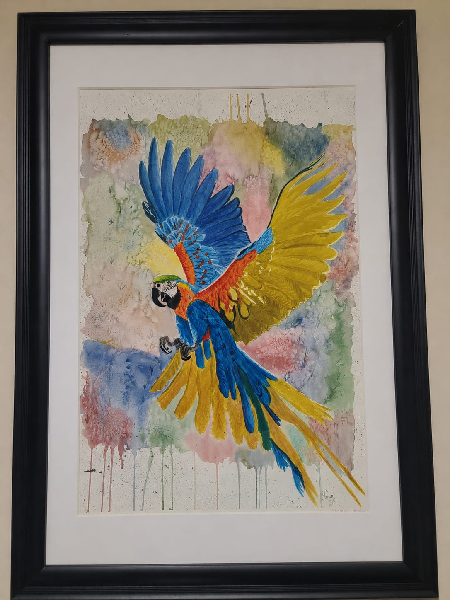
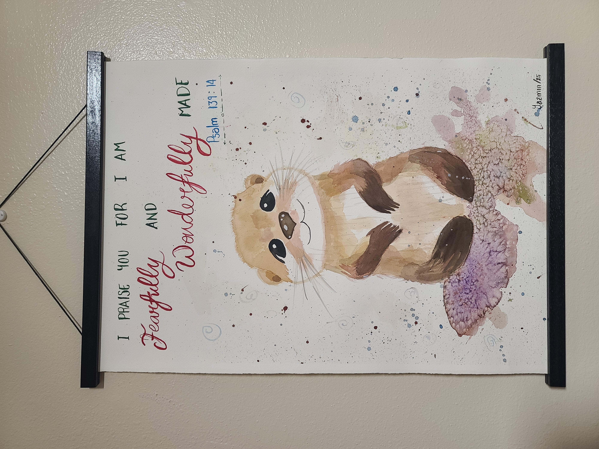
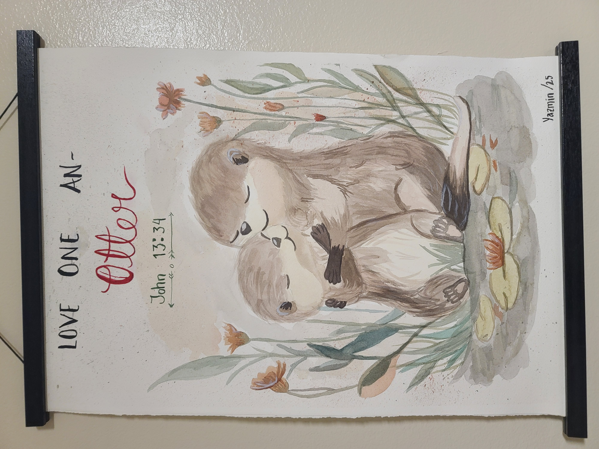
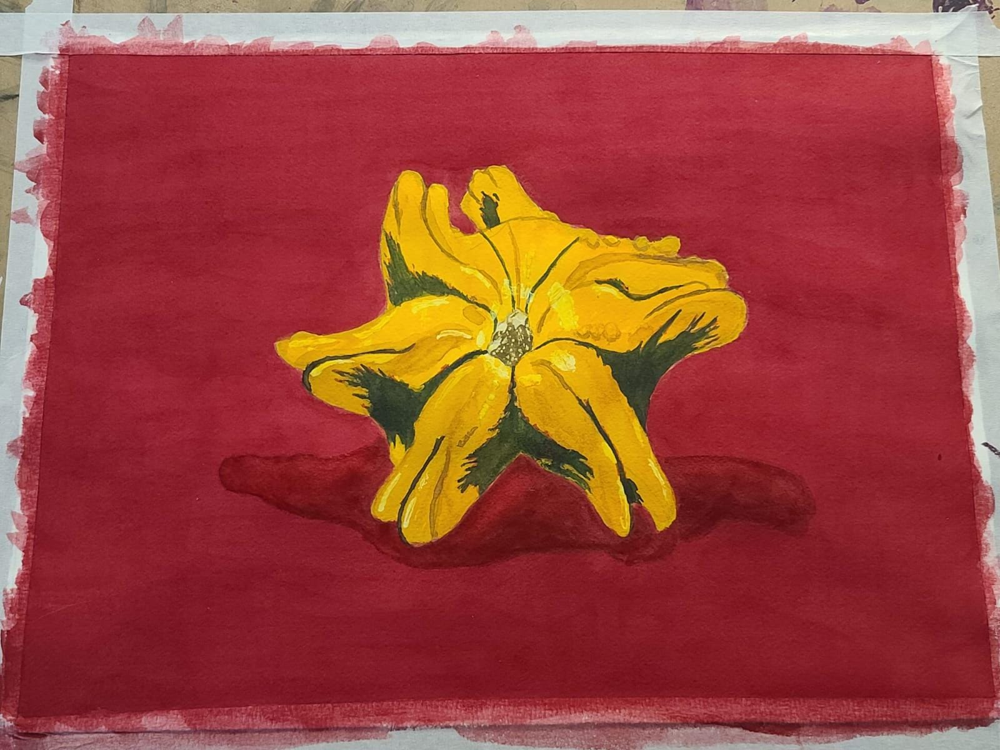
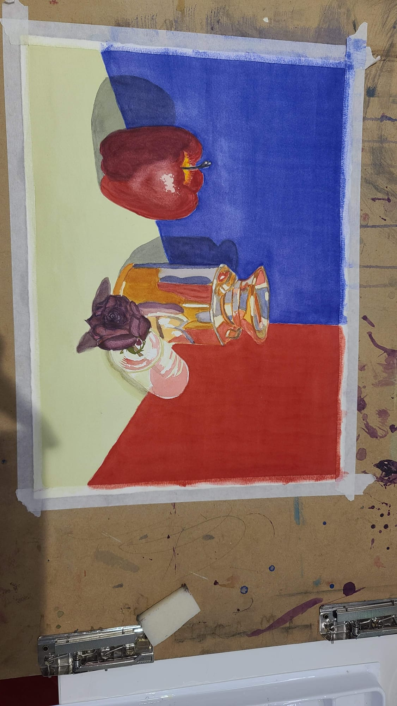

# My Traditional Art Portfolio 🎨✨

Welcome to my creative space! Here, I share a collection of my handmade paintings using watercolor techniques. Each piece reflects my love for nature, color, and rich detail.

---

## 🖼️ Artwork Gallery

### 🌲 My Favorite Place (Yosemite)

*A landscape piece inspired by Yosemite, capturing the majesty of nature, towering trees, and a subtle reflection on the water.*

### 🦁 The Lion and the Lamb

*A profound piece that plays with fluid textures and the contrast of expressions between strength and innocence.*

### 🦜 Macaw in Flight

*An explosion of vibrant, dynamic colors capturing the majesty of a tropical bird mid-flight.*

### 🦦 Otter Collection & Illustration
Here are two heartwarming illustrations featuring custom lettering and special messages:

| "Fearfully & Wonderfully Made" | "Love One An-Otter" |
| :---: | :---: |
|  |  |

### 🎃 Pumpkin & Flowers Still Life

*A still life study contrasting warm, vibrant tones against a deep background.*

### 🍎 Still Life & Light Reflections

*A technical exercise studying color harmony, shadows, and metallic reflections on surfaces.*

---
Thank you for visiting my gallery! If you are interested in my work or would like to connect, feel free to explore my projects.
